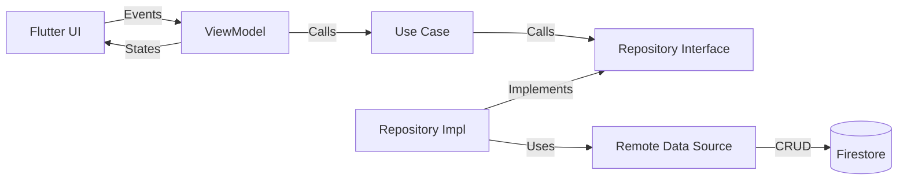

# Progress Pals

A Flutter application for tracking habits and sharing progress with friends.

## Getting Started

To get a local copy up and running, follow these simple steps.

### Prerequisites

*   [Flutter](https://flutter.dev/docs/get-started/install)

### Installation

1.  Clone the repo
    ```sh
    git clone https://github.com/Lesetja-Malapane/progress-pals.git
    ```
2.  Install packages
    ```sh
    flutter pub get
    ```
3.  Run the app
    ```sh
    flutter run
    ```

## Project Structure

```
lib/
├── main.dart                  # Entry point (initializes Firebase, DI)
├── app.dart                   # Root widget (Theme, Routing)
├── core/                      # Shared code across features
│   ├── di/                    # Dependency Injection (get_it + injectable)
│   ├── errors/                # Failure classes, Exceptions
│   ├── services/              # Third-party wrappers (Crashlytics, Logger)
│   └── utils/                 # Date helpers, Validators
├── features/
│   ├── auth/                  # Authentication Feature
│   ├── habits/                # Core Habit Tracking Feature
│   │   ├── data/
│   │   │   ├── datasources/   # RemoteDataSource (Firestore), LocalDataSource
│   │   │   ├── models/        # DTOs (Data Transfer Objects with to/fromJson)
│   │   │   └── repositories/  # Implementation of Domain Repository
│   │   ├── domain/
│   │   │   ├── entities/      # Pure Dart classes (freezed recommended)
│   │   │   ├── repositories/  # Abstract Repository Interfaces
│   │   │   └── usecases/      # Single responsibility business logic
│   │   └── presentation/
│   │       ├── bloc/          # or ViewModels (Riverpod/Bloc/Provider)
│   │       ├── pages/         # Scaffold screens
│   │       └── widgets/       # Feature-specific widgets
│   └── social/                # Friends & Accountability
└── shared/                    # Shared UI components (Buttons, Inputs)
```

## Data Flow



## Dependencies

*   [flutter](https://flutter.dev)
*   [cupertino_icons](https://pub.dev/packages/cupertino_icons)
*   [firebase_core](https://pub.dev/packages/firebase_core)

## Testing

This project uses `flutter_test` for widget testing.

## Contributing

Contributions are what make the open source community such an amazing place to learn, inspire, and create. Any contributions you make are **greatly appreciated**.

If you have a suggestion that would make this better, please fork the repo and create a pull request. You can also simply open an issue with the tag "enhancement".

1.  Fork the Project
2.  Create your Feature Branch (`git checkout -b feature/AmazingFeature`)
3.  Commit your Changes (`git commit -m 'Add some AmazingFeature'`)
4.  Push to the Branch (`git push origin feature/AmazingFeature`)
5.  Open a Pull Request
